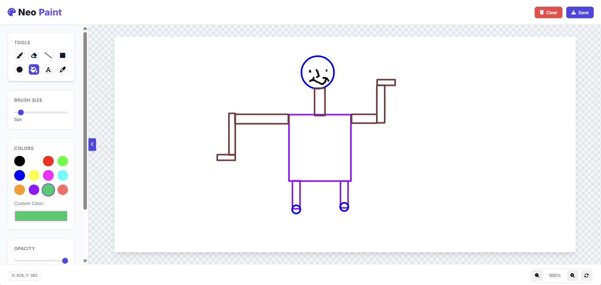

# NeoPaint - Modern Web Painting Application



NeoPaint is a feature-rich, modern web-based painting application built with HTML5 Canvas, CSS3, and vanilla JavaScript. Designed with a sleek, intuitive interface, it offers a comprehensive set of tools for digital artists, designers, and anyone who wants to express their creativity online.

## Features

🎨 **Drawing Tools**
- Brush with adjustable size and opacity
- Eraser with variable size
- Line, Rectangle, and Circle tools
- Flood fill (paint bucket) functionality
- Text tool with custom input
- Eyedropper for color picking

🌈 **Color Management**
- Predefined color palette
- Custom color picker
- Opacity control for all tools

🔄 **Advanced Features**
- Undo/Redo functionality (with history tracking)
- Canvas zoom in/out and reset
- Responsive design that works on desktop and tablets
- Touch screen support for mobile devices
- Save artwork as PNG image

⚙️ **User Experience**
- Clean, modern UI with animations
- Real-time cursor position tracking
- Notification system
- Collapsible toolbar for more drawing space
- Smooth performance with optimized rendering

## Live Demo

Try NeoPaint online: [https://neo-paint.vercel.app/](https://neo-paint.vercel.app/)

## Installation

To run NeoPaint locally:

1. Clone the repository:
   ```bash
   git clone https://github.com/Bhavu7/NeoPaint.git